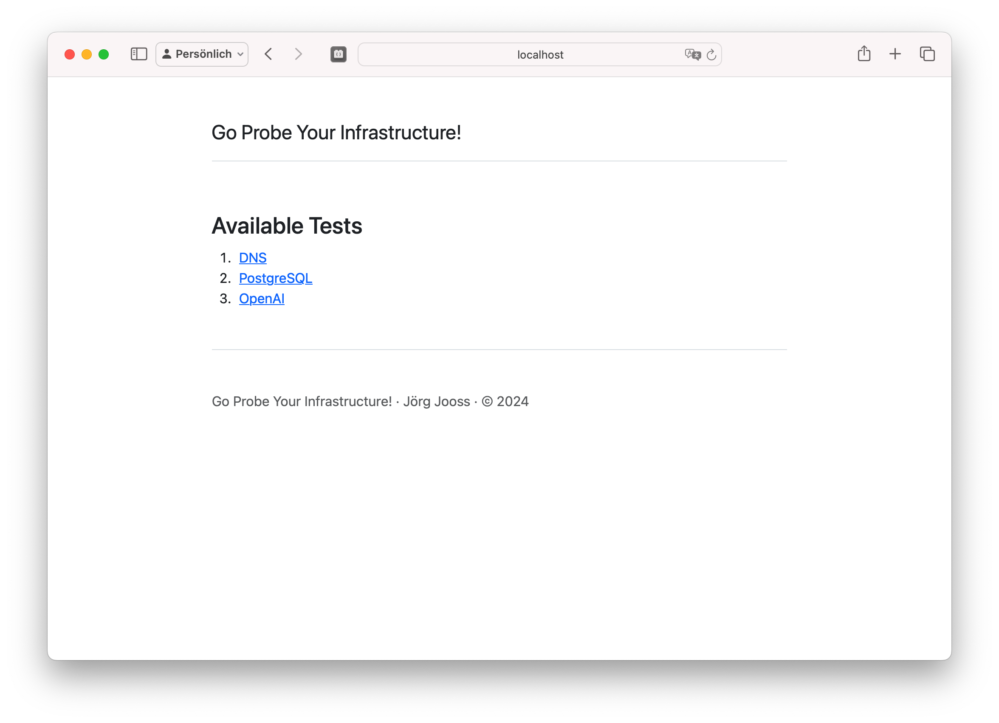

# go-probe


Quick and somewhat dirty Go web application to test DNS entries, ping PostgreSQL servers and chat with your Azure OpenAI endpoints.

## OS support
go-probe currently supports running macOS and Linux. It has not been tested on Windows yet.

## Configuration options
go-probe can be configured by exporting the following environment variables:

Env var                    | Purpose                         | Default value
---------------------------|---------------------------------|-------------------------
GO_PROBE_CSRF_KEY          | Secure key for CSRF protection  | None, must be set
GO_PROBE_SERVER_ADDR       | HTTP listen address             | `:8080`
GO_PROBE_DEVELOPER_MODE    | Allows running the application over plan HTTP and prints DEBUG level logs | `false`

## Building
Install [Go](https://go.dev/dl/) and clone this repo.
Open a terminal window and run

```bash
cd path/to/repo
go build ./cmd/server
```

## Running
Assuming you have built the binary as described above, run
```bash
export GO_PROBE_CSRF_KEY=$(openssl rand -hex 20)
./server
```

Now open http://localhost:8080 on your browser.



## Warning
:fire: :fire: :fire: 
_Do not_ expose go-probe over HTTP only publicly. Some of its tests require you to enter sensitive information which you should provide if the app is exposed over HTTPS!